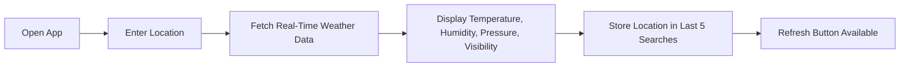

# 🌤️ Weather App

## ✨ Project Overview

The **Weather App** provides **real-time weather information** for any location worldwide.
Built with **Flutter** and **Dart**, the app runs on both **Android** ,**IOS** and the **Web**, offering a consistent, responsive, and visually appealing experience.

It integrates with a **Weather API** for accurate real-time weather data and includes a **search history feature**, allowing users to quickly revisit their last 5 searches.

The app is perfect for travelers, daily weather checkers, or anyone who wants **quick access to weather forecasts** in a clean and interactive interface.

---

##  Key Features

* 🌍 **Real-Time Weather Data:** Fetches current weather for any city using Weather API.
* 🧭 **Search History:** Stores the last 5 searches to quickly revisit locations.
* 🔄 **Refresh Button:** Update weather data instantly.
* 🌡️ **Comprehensive Weather Info:** Displays temperature, humidity, air pressure, visibility, and more.
* 📱 **Cross-Platform Support:** Fully functional on Android,Ios and web browsers.
* 🎨 **Modern UI:** Clean, user-friendly interface with smooth navigation.
* 🌦️ **Dynamic Weather Display:** Weather icons change based on current conditions.

---

## Tech Stack

| Technology         | Description                             |
| ------------------ | --------------------------------------- |
| Flutter            | Cross-platform UI framework             |
| Dart               | Programming language                    |
| OpenWeatherMap API | Real-time weather data                  |
| Stateful Widgets   | Dynamic UI updates and interactivity    |
| Local Storage      | Stores last 5 searches for quick access |
| Platform           | Android & Web& ios                      |    |

---

##  App Workflow



**How it works:**

* User enters a city or location
* App fetches **real-time weather data** from Weather API
* Displays temperature, humidity, air pressure, visibility, and weather condition
* Stores the location in **search history** (up to 5 locations)
* Refresh button updates weather data instantly

---

## 🖼️ Screenshots

### Home / Search Screen


### Weather Details


](https://github.com/user-attachments/assets/6e6a3f93-025b-4fbb-bc65-34ac1a944a85)


## ⚙️ Installation & Setup

```bash
# 1. Clone the repository
git clone https://github.com/yourusername/weather-app.git

# 2. Navigate to project directory
cd weather-app

# 3. Install dependencies
flutter pub get

# 4. Add your Weather API key
# Create `lib/secrets.dart`:
# const String apiKey = "YOUR_API_KEY";

# 5. Run the app
flutter run
```

---

## 🧩 How It Works

* Uses **OpenWeatherMap API** for fetching live weather information.
* User input triggers a **network request** to fetch data.
* **Search history** uses local storage to save the last 5 locations.
* Dynamic UI displays **temperature, humidity, pressure, visibility**, and weather condition icons.
* Refresh button **re-fetches** data for the current location instantly.

---

##  Future Enhancements
* 🕶️ Dark/Light theme toggle
* 📍 GPS integration to automatically detect current location
* 🔔 Push notifications for severe weather alerts
* 🌎 Multi-language support

---


## 💡 Why This App Stands Out

* Real-time, accurate weather data
* Stores **recent searches** for faster access
* Fully responsive **cross-platform support**
* Clean and professional Flutter UI
* Fast, reliable, and easy to use

---

## ⭐ Show Your Support

If you like this project:

* ⭐ **Star this repository** on GitHub
* 🐛 Report issues or submit **pull requests**


